# Themes

Fourteen palette adaptations from popular Zed and Ghostty theme families. Choose a look below, then open **Quick Settings → Open Config** and replace the existing `[appearance]` section in `~/.config/lyricise/config.toml` with its snippet. Keep your other sections. Lyricise reloads the file when you save.

Each screenshot uses “Hey Jude” by The Beatles paused around halfway, the same layout, and the same desktop backdrop, with 75% opacity and blur set to 8. Adjust `background_opacity` (`0`–`1`) and `blur` (`0`–`100`) to taste. Font, size, spacing, and corners are customizable too.

The selection draws on the [Zed theme catalogue](https://zed.dev/extensions?filter=themes); it is not a combined popularity ranking. Colors come from Ghostty's bundled [iTerm2 Color Schemes](https://github.com/mbadolato/iTerm2-Color-Schemes/tree/master/ghostty), adapted to Lyricise's background, text, and active-line roles. Catppuccin Mocha keeps Lyricise's lavender highlight.

# Catppuccin Mocha

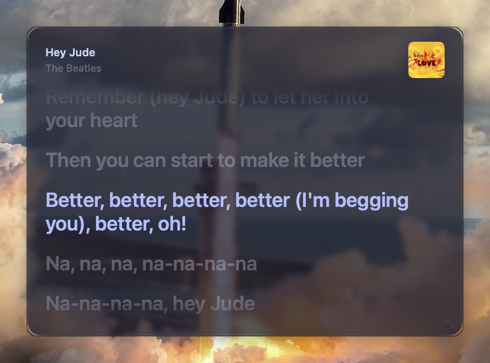

```toml
[appearance]
background = "#1e1e2e"
text = "#cdd6f4"
accent = "#b4befe"
muted_text = "#6c7086"
background_opacity = 0.75
blur = 8
font = "SF Pro"
font_size = 22
padding = 20
corner_radius = 16
```

# Catppuccin Latte

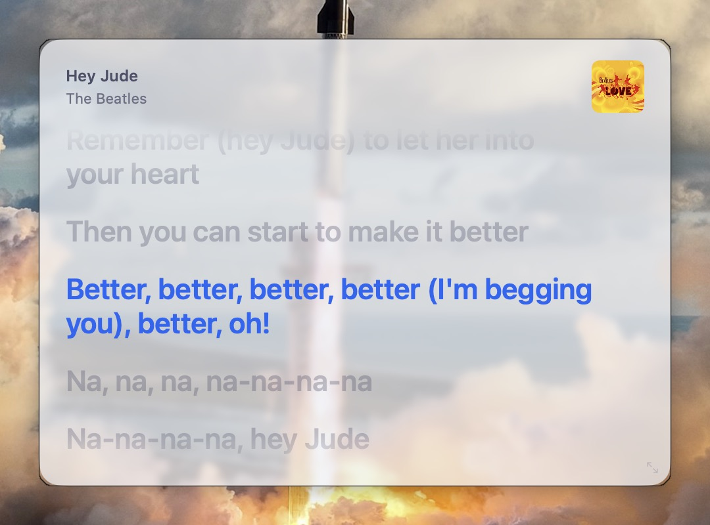

```toml
[appearance]
background = "#eff1f5"
text = "#4c4f69"
accent = "#1e66f5"
muted_text = "#6c6f85"
background_opacity = 0.75
blur = 8
font = "SF Pro"
font_size = 22
padding = 20
corner_radius = 16
```

# Catppuccin Frappé

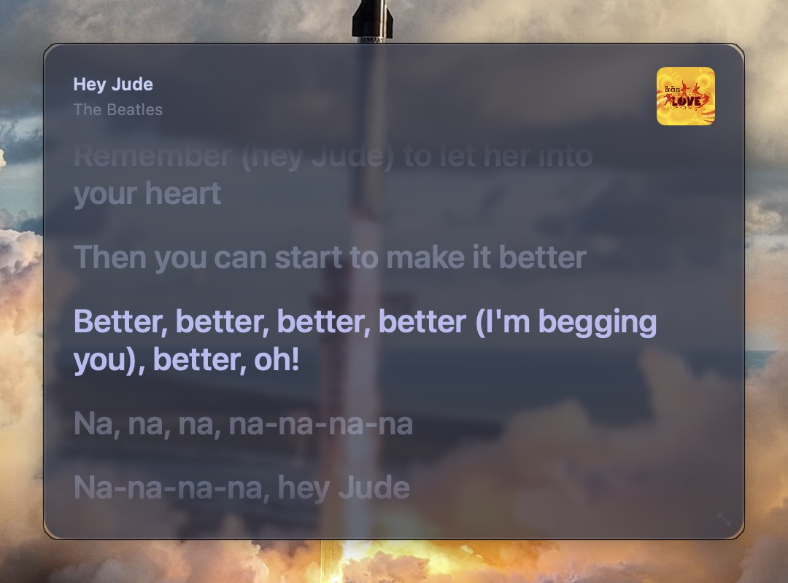

```toml
[appearance]
background = "#303446"
text = "#c6d0f5"
accent = "#babbf1"
muted_text = "#737994"
background_opacity = 0.75
blur = 8
font = "SF Pro"
font_size = 22
padding = 20
corner_radius = 16
```

# Catppuccin Macchiato

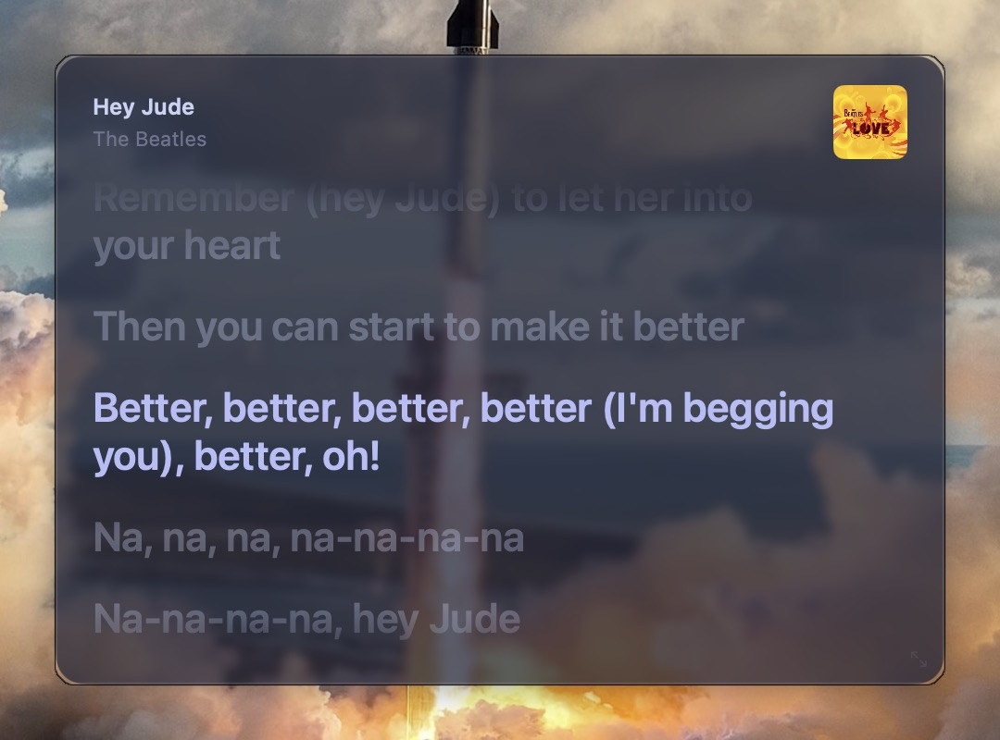

```toml
[appearance]
background = "#24273a"
text = "#cad3f5"
accent = "#b7bdf8"
muted_text = "#6e738d"
background_opacity = 0.75
blur = 8
font = "SF Pro"
font_size = 22
padding = 20
corner_radius = 16
```

# Tokyo Night

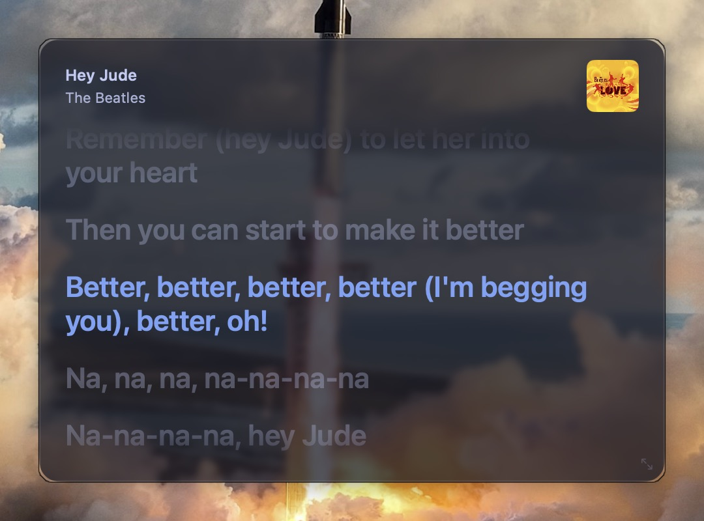

```toml
[appearance]
background = "#1a1b26"
text = "#c0caf5"
accent = "#7aa2f7"
muted_text = "#a9b1d6"
background_opacity = 0.75
blur = 8
font = "SF Pro"
font_size = 22
padding = 20
corner_radius = 16
```

# One Dark

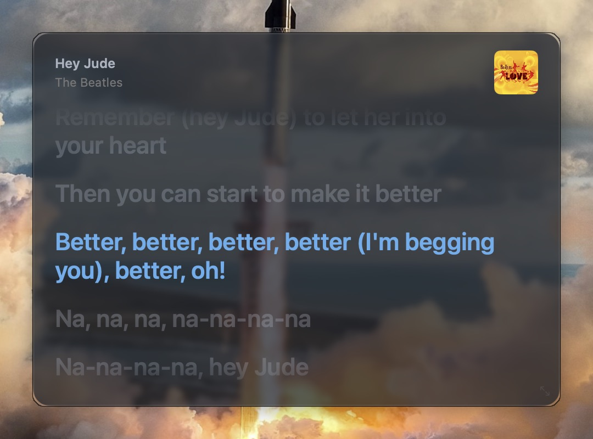

```toml
[appearance]
background = "#21252b"
text = "#abb2bf"
accent = "#61afef"
muted_text = "#767676"
background_opacity = 0.75
blur = 8
font = "SF Pro"
font_size = 22
padding = 20
corner_radius = 16
```

# GitHub Dark

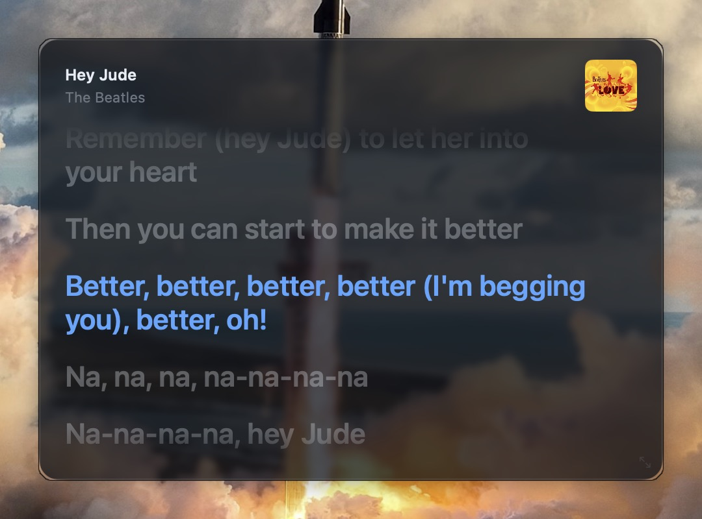

```toml
[appearance]
background = "#0d1117"
text = "#e6edf3"
accent = "#58a6ff"
muted_text = "#6e7681"
background_opacity = 0.75
blur = 8
font = "SF Pro"
font_size = 22
padding = 20
corner_radius = 16
```

# Nightfox

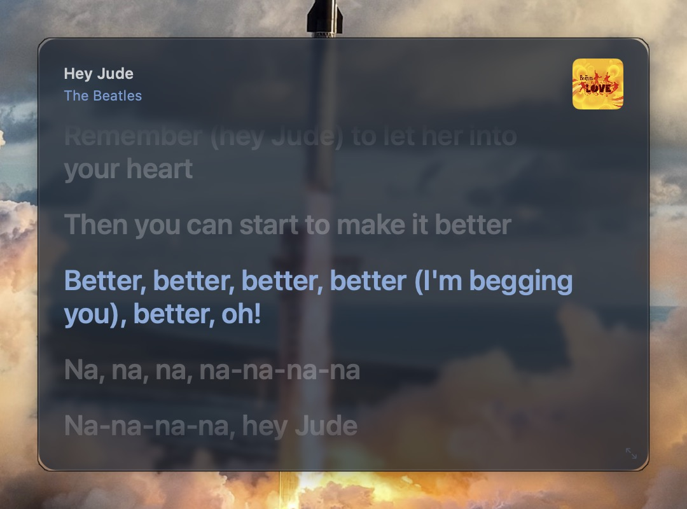

```toml
[appearance]
background = "#192330"
text = "#cdcecf"
accent = "#86abdc"
muted_text = "#719cd6"
background_opacity = 0.75
blur = 8
font = "SF Pro"
font_size = 22
padding = 20
corner_radius = 16
```

# Dracula

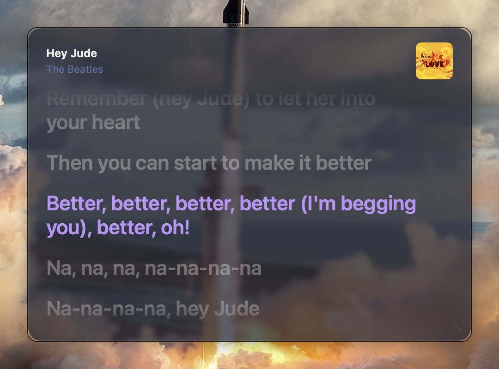

```toml
[appearance]
background = "#282a36"
text = "#f8f8f2"
accent = "#bd93f9"
muted_text = "#6272a4"
background_opacity = 0.75
blur = 8
font = "SF Pro"
font_size = 22
padding = 20
corner_radius = 16
```

# Snazzy

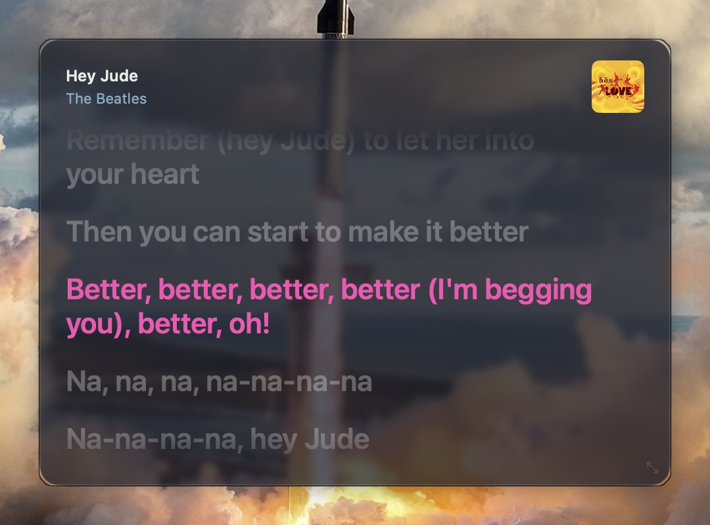

```toml
[appearance]
background = "#1e1f29"
text = "#ebece6"
accent = "#fc4cb4"
muted_text = "#81aec6"
background_opacity = 0.75
blur = 8
font = "SF Pro"
font_size = 22
padding = 20
corner_radius = 16
```

# Nord

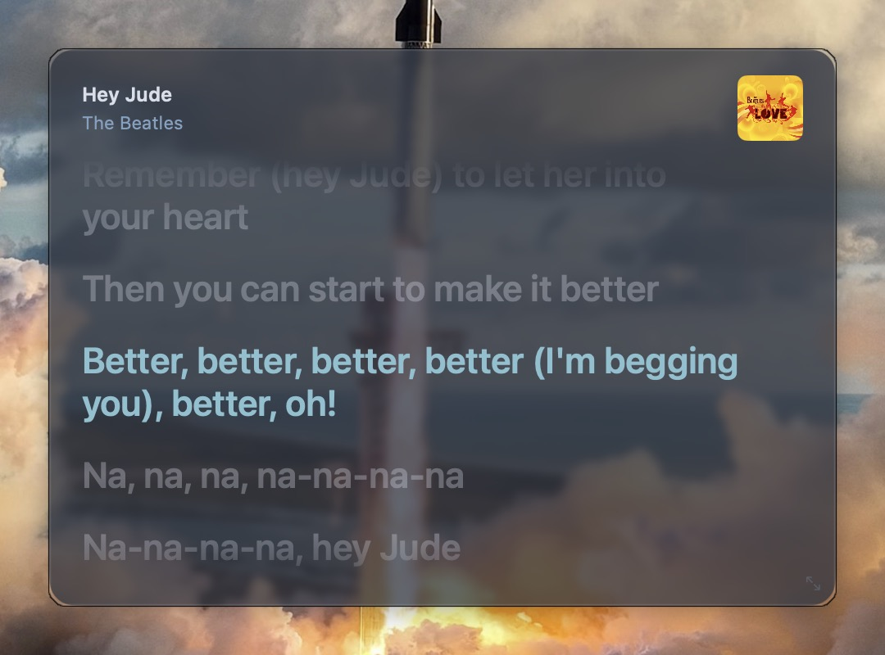

```toml
[appearance]
background = "#2e3440"
text = "#d8dee9"
accent = "#88c0d0"
muted_text = "#81a1c1"
background_opacity = 0.75
blur = 8
font = "SF Pro"
font_size = 22
padding = 20
corner_radius = 16
```

# Gruvbox Dark

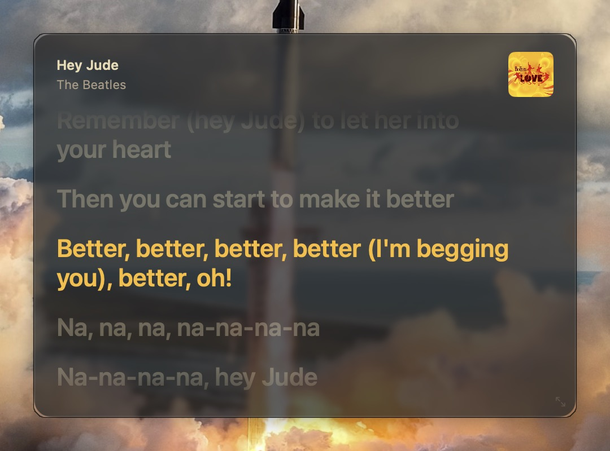

```toml
[appearance]
background = "#282828"
text = "#ebdbb2"
accent = "#fabd2f"
muted_text = "#a89984"
background_opacity = 0.75
blur = 8
font = "SF Pro"
font_size = 22
padding = 20
corner_radius = 16
```

# Rosé Pine

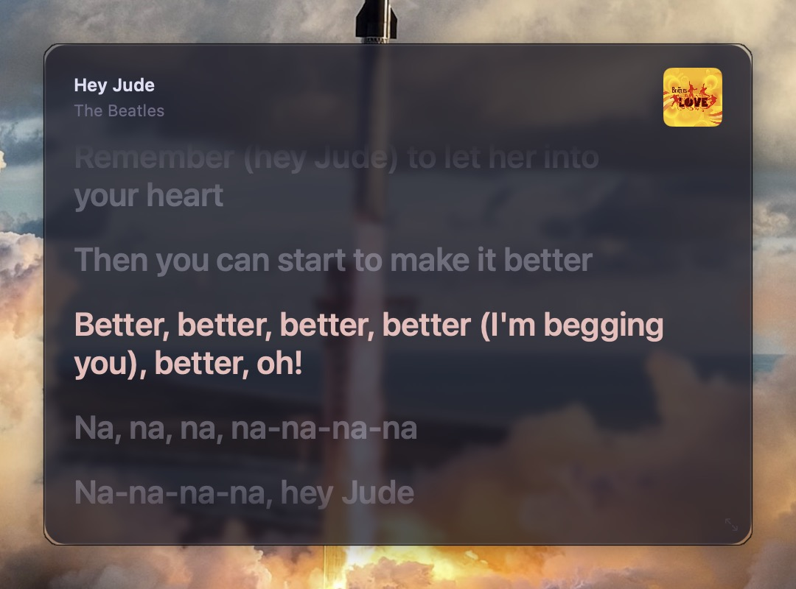

```toml
[appearance]
background = "#191724"
text = "#e0def4"
accent = "#ebbcba"
muted_text = "#6e6a86"
background_opacity = 0.75
blur = 8
font = "SF Pro"
font_size = 22
padding = 20
corner_radius = 16
```

# Solarized Light

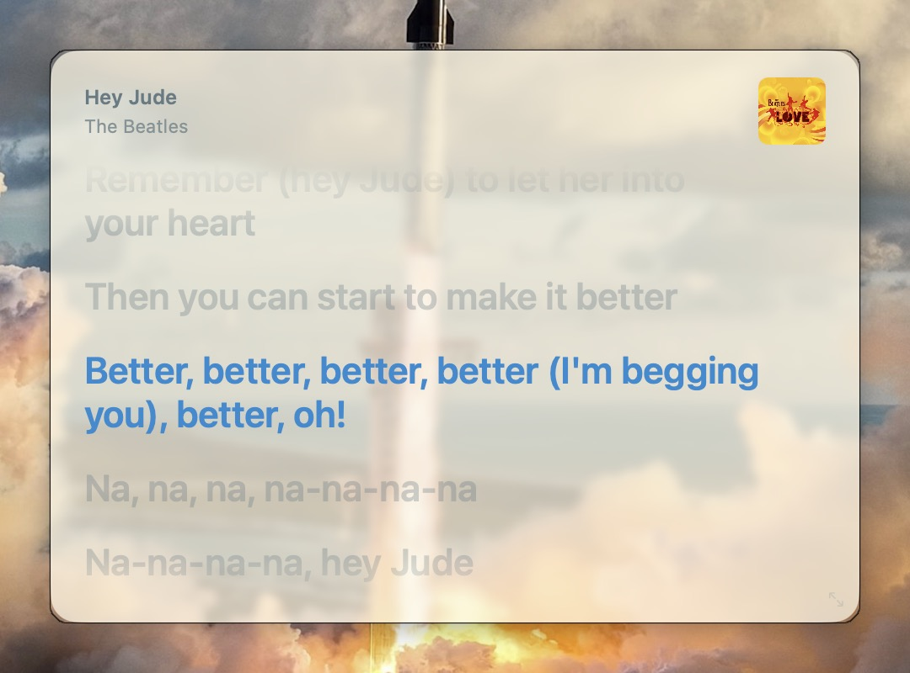

```toml
[appearance]
background = "#fdf6e3"
text = "#657b83"
accent = "#268bd2"
muted_text = "#839496"
background_opacity = 0.75
blur = 8
font = "SF Pro"
font_size = 22
padding = 20
corner_radius = 16
```
